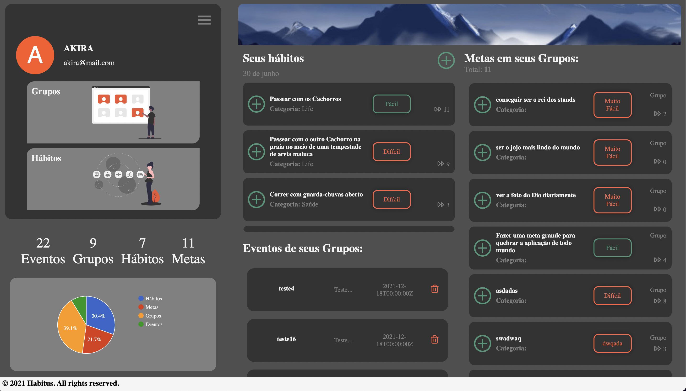

# Habitus

A collaborative project built as a aplication to you keep traking your life style and share with friends/community.

Figma: [https://www.figma.com/file/Hl0dUQEIOviZLPqMlKB5Mt/Figma---Grupo-3?node-id=0%3A1](https://www.figma.com/file/Hl0dUQEIOviZLPqMlKB5Mt/Figma---Grupo-3?node-id=0%3A1)

Vercel deploy link: [https://ts-hamburgueria-wagnerfabricio.vercel.app/](https://habits-group3.vercel.app/)

<td valign="top" width="33%">

## Images:

</td>

<td valign="top" width="33%">

### Techs:

</td>
